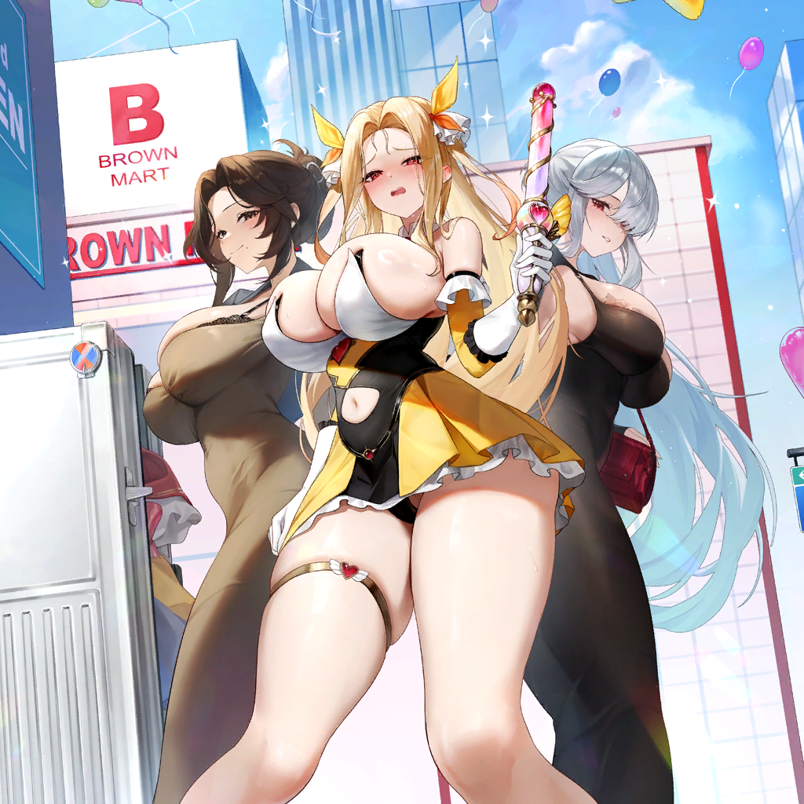
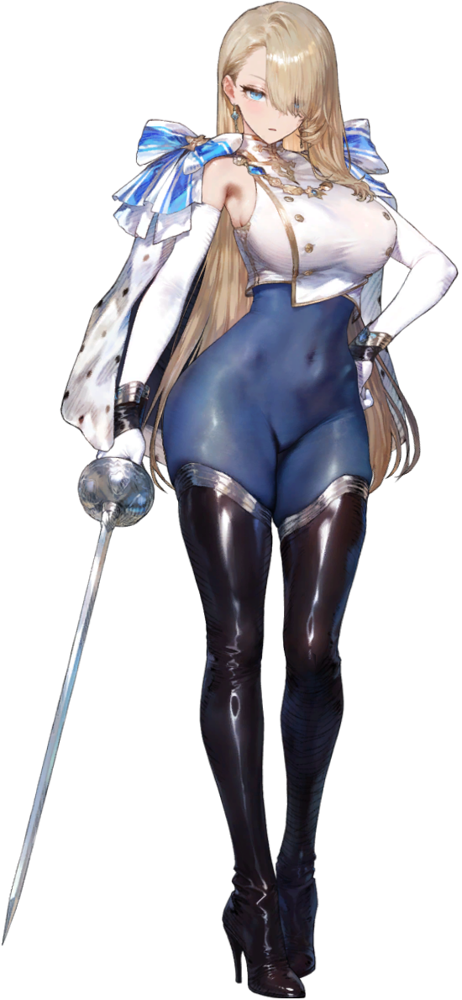
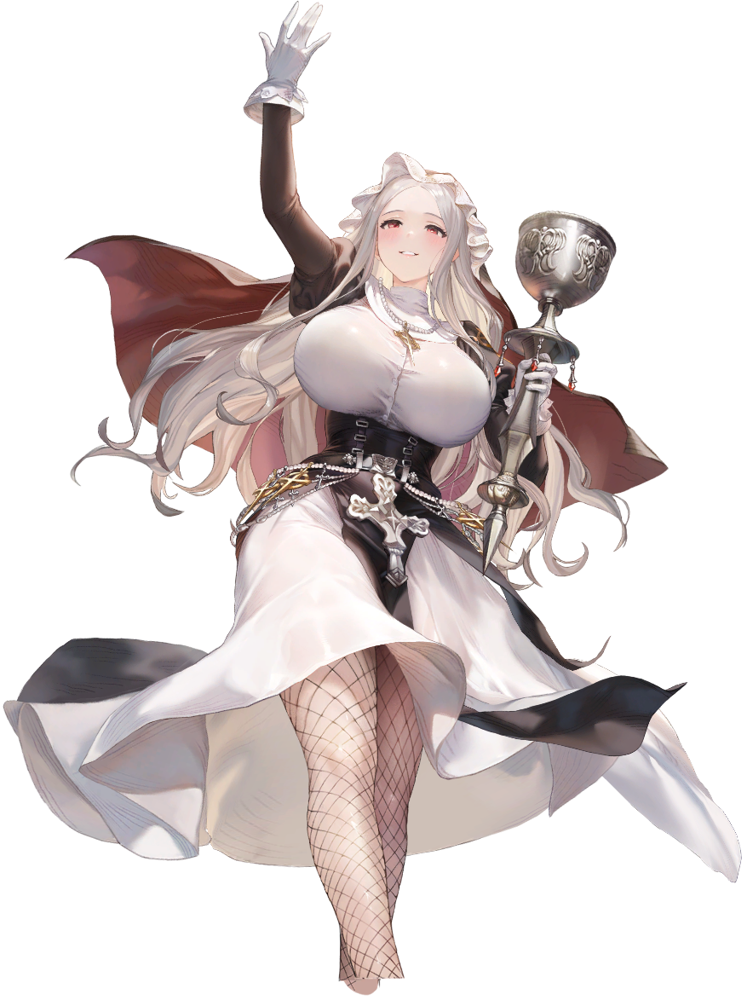
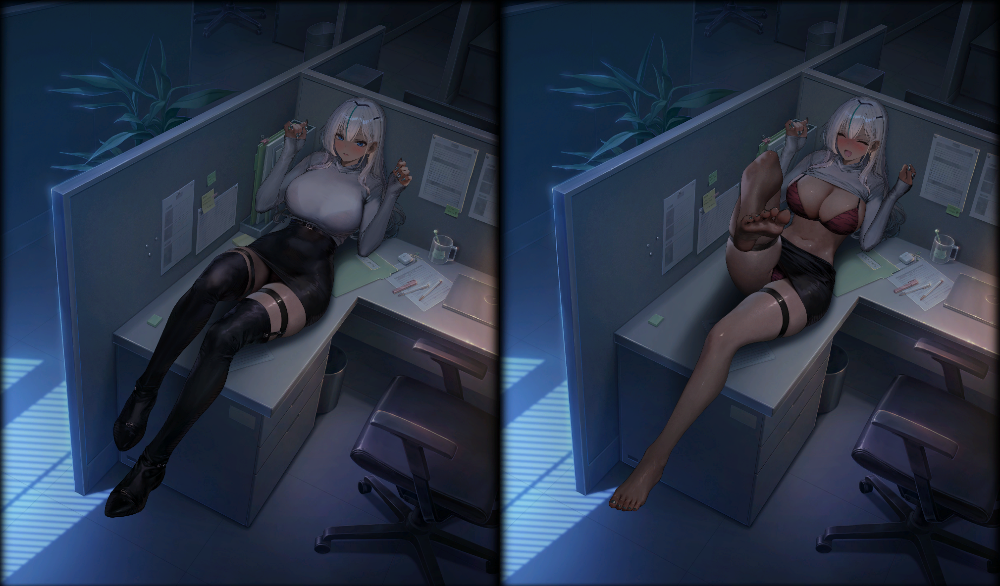
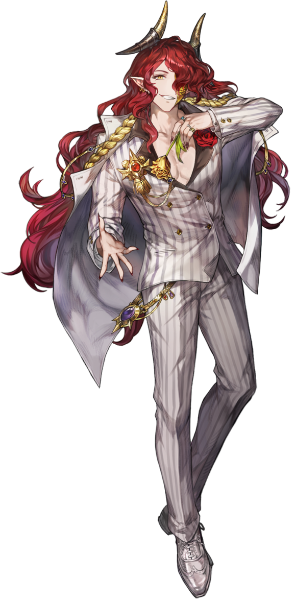
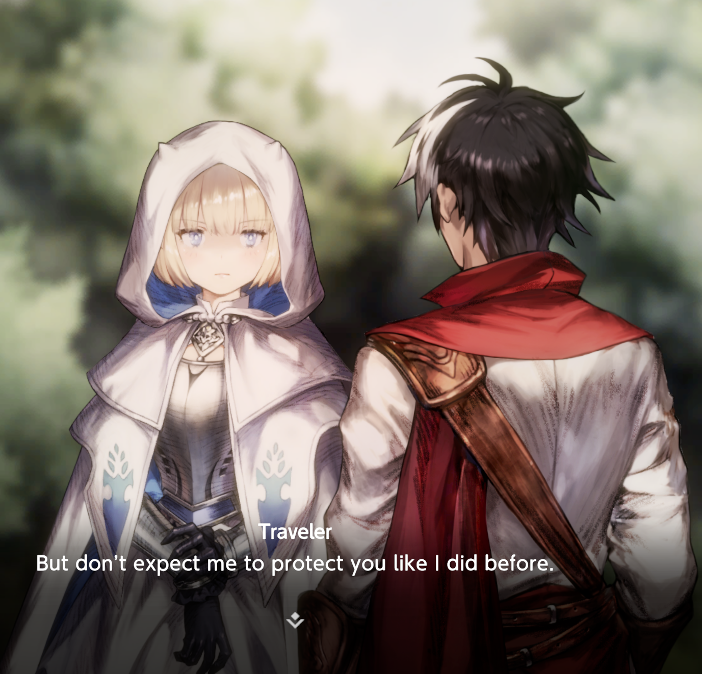
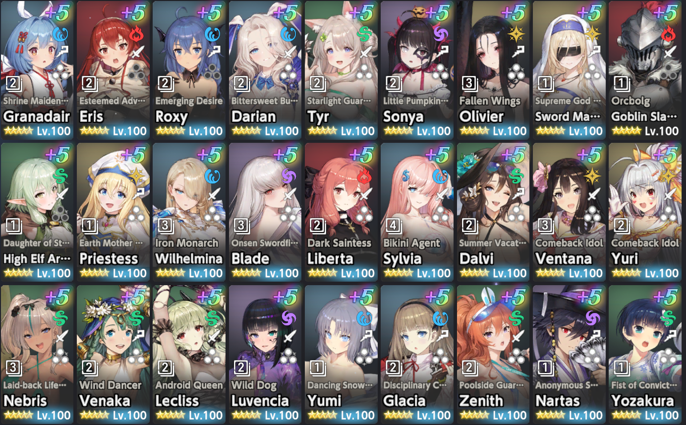
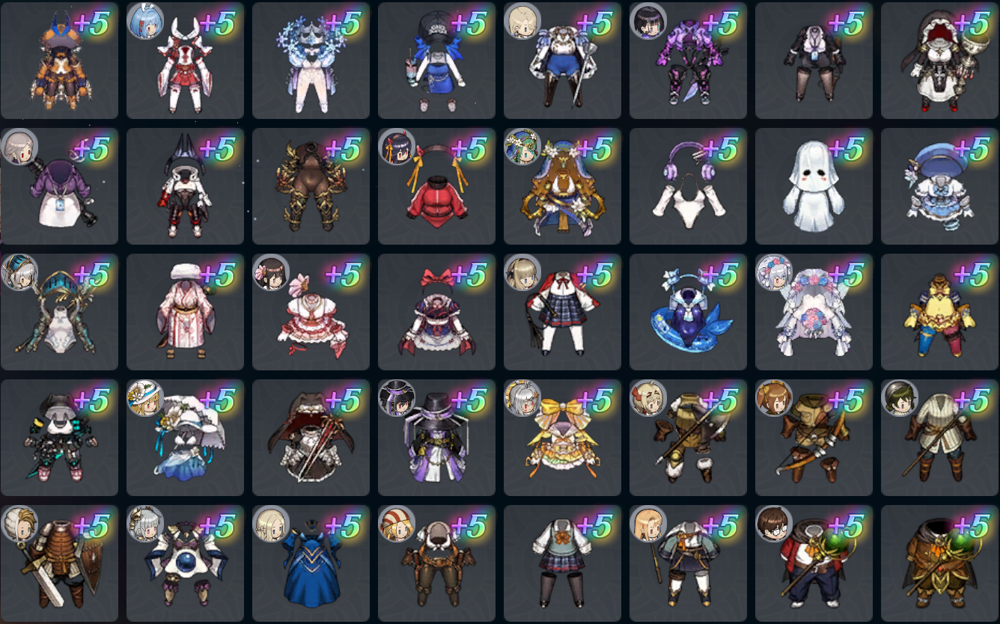

# Brown-Dust-2-Assets

 

 

This Repo archives the Assets from the Game: Brown Dust 2. More focused on the Spine Models, Illustrations and Icons.

## Content

- [Spine Models](#spine-models)
  - [Character Models](#character-models)
  - [Skill Cutscene Models](#skill-cutscenes)
  - [Interaction Models](#interaction-models)
  - [NPC Models](#npc-models)
  - [Light Novel Talk Models](#light-novel-talk-models)
- [UI](#ui)
  - [Costume Faces](#costume-faces)
  - [Costume Icons](#costume-icons)
- [Known Issues](#known-stuff-i-need-to-fix)
- [Report Issues](#report-issues)
- [3rd Party](#3rd-party-dependencies)
  - [Unity Assest Extractor](#assets-extractor)

## Spine Models
### Character Models

  

 

The character models are sorted by Character Name and Costume. If a Character only has one costume all the needed files are directly in the Character folder.  
Here are only the character models included that are from playable / upcoming costumes of the current patch.  
Prestige Skin Character Models are included in the Character Folder.  

[Go to Character Models](assets/spine/character/)

### Skill Cutscenes

  
  

 

The skill cutscene models are sorted by Charater name and Costume. If a Character only has one costume all the needed files are directly in the Character folder.  
Not every Character has a cutscene therefore some characters are not in there.  
The models dont have the background backed in. Those will be added later in a separate folder unsorted.  
Prestige Skin Skill Cutscene Models are included in the Character Folder.  

[Go to Skill Cutscene Models](assets/spine/skill_cutscene/)

### Interaction Models

  

 

The interaction models are soreted by Character and Costume.  
Those models have the background backed in. So there will be no extra folder for the backgrounds.  
Prestige Skin Interactions are included in the Character folder.

[Go to Interaction Models](assets/spine/interaction/)

### NPC Models

  

 

The NPC's from all shops, modes or events that have a spine model are sorted by character name.  

[Go to NPC Models](assets/spine/npc/)

### Light Novel Talk Models

  
 
  

 

The Light Novel Talk Models are mostly used in the Story Pack 1 to 10 after that its rare that characters get such a model.  
In the example with Eclipse the pose of those models are less dynamic and most of them get a back view.  

[Go to Light Novel Talk Models](assets/spine/light_novel_talk/)

## UI
### Costume Faces

  

 

All faces of the costumes used in the Companion Menu.  
Those faces are only from playable costumes, skins, temporary companions or summons.

### Costume Icons

  

 

All icons of the costumes used in the Bag Menu under Costume or in the Collection under Costumes.  
Those icons are only from playable costumes, skins or temporary companions.

## Known Issues

Last Hope Loen is missing the spine -> character folder because her character model is only as npc spine in the game  
I will copy the files and make all the needed changes to file names and the atlas file that she has a proper spine model like all other costumes have...

Bright Moon Dalvi, Sword Queen Sylvia, Gamer Club Rafina, Kind Liberator Samay are cursed if you open then now -> Reason extracted PNG has diff Size then in the atlas file expected, if you want to open then just resize them to the size writen in the atlas file  
I will do a check later that fixed those sizing issues

Cursed Celia has a weird ID in the charater spine folder -> her offical id is based of the "new" cutscene 060401 i will fix that later too  
B-Rank Manager Gray has in every file a .skel. i will remove tht later too  
B-Rank Helene Skill Cutscene used cutscene\_Char instead of cutscene\_char  
Those error need a fix in name of the file and changing the .atlas file for that costume if you want to make on your own in the meantime

UI -> costume\_icon  
There are few files that dont follow the default naming pattern like icon\_costumeXXXXXX its just icon\_costumeXXX i will append the missing numbers later too

## Report Issues

If you find any other weird file naming or files that doesnt match the default pattern of that section pls open an issue  
The same goes for stuff you like to have included in the repo  

Make a Issue [here](https://github.com/Zormolo/Brown-Dust-2-Assets/issues)

I will ofc add more stuff  
but what is there atm is the most important for most ppl  
I will also add the audio files when i have a good CLI client to extract them from the bank-files

## 3rd Party Dependencies
### Assets Extractor

The extractor is made by Aelurum. Version 1.2.3 of the CLI is used.  
Link to Repo --> https://github.com/aelurum/AssetStudio