# Brown-Dust-2-Assets

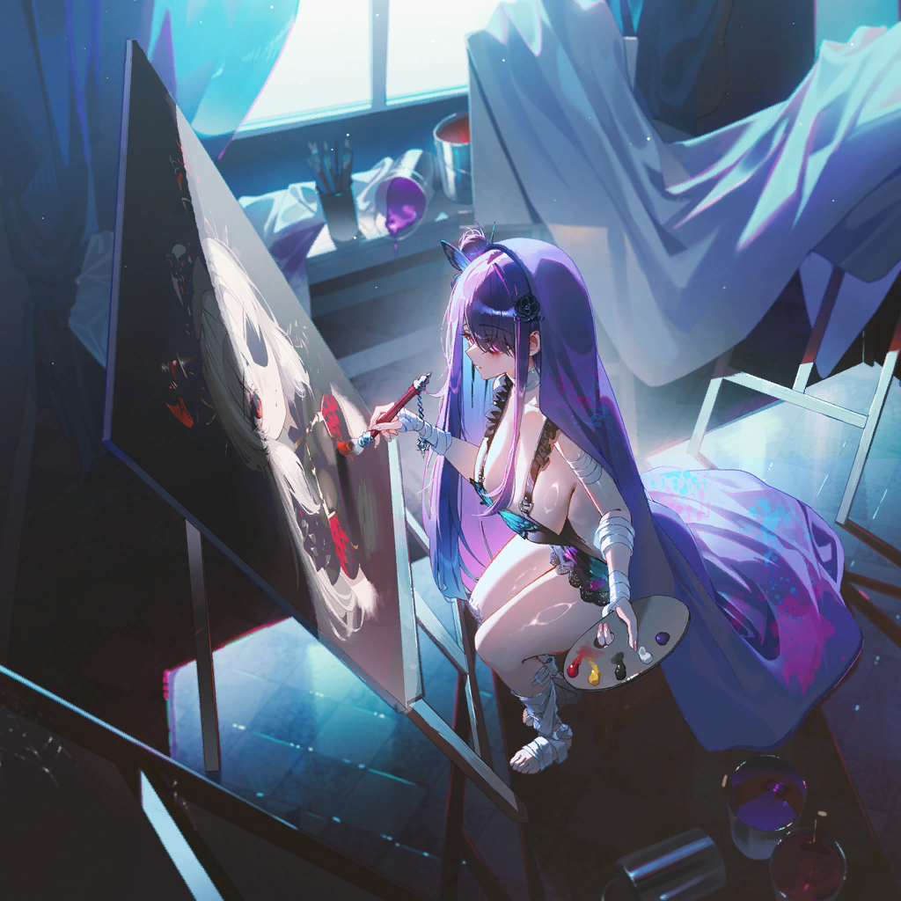 

 

This Repo archives the Assets from the Game: Brown Dust 2. More focused on the Spine Models, Illustrations and Icons.

## Content

- [Spine Models](#spine-models)
  - [Character Models](#character-models)
  - [Interaction Models](#interaction-models)
  - [Light Novel Talk Models](#light-novel-talk-models)
  - [Miscellaneous](#miscellaneous-models)
  - [NPC Models](#npc-models)
  - [Skill Cutscene Models](#skill-cutscenes)
  - [Special Animation Models](#special-animation-models)
- [UI](#ui)
  - [Costume Faces](#costume-faces)
  - [Costume Icons](#costume-icons)
  - [Costume Skill Faces](#costume-skill-faces)
  - [Skill Cutscene Backgrounds](#skill-cutscene-backgrounds)
  - [Skill Icons](#skill-icons)
  - [Speech Bubble Faces](#speech-bubble-faces)
  - [Wallpapers](#wallpapers)
- [Chibis](#chibis)
- [Known Issues](#known-stuff-i-need-to-fix)
- [Report Issues](#report-issues)
- [3rd Party](#3rd-party-dependencies)
  - [Unity Assest Extractor](#assets-extractor)

## Spine Models
### Character Models

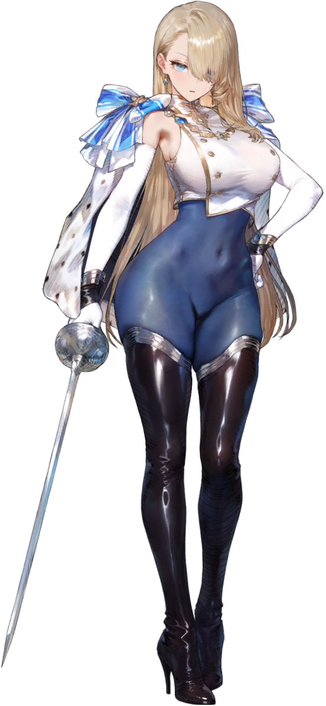  

 

The character models are sorted by Character Name and Costume. If a Character only has one costume all the needed files are directly in the Character folder.  
Here are only the character models included that are from playable / upcoming costumes of the current patch.  
Prestige Skin Character Models are included in the Character Folder.  

[Go to Character Models](assets/spine/character/)

### Interaction Models

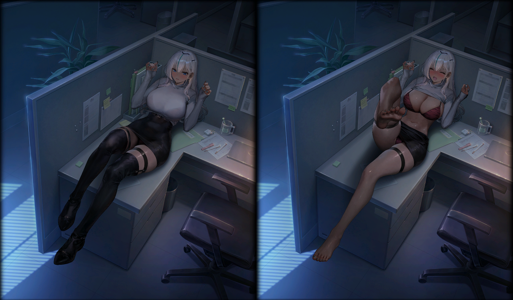  

 

The interaction models are soreted by Character and Costume.  
Those models have the background backed in. So there will be no extra folder for the backgrounds.  
Prestige Skin Interactions are included in the Character folder.

[Go to Interaction Models](assets/spine/interaction/)

### Light Novel Talk Models

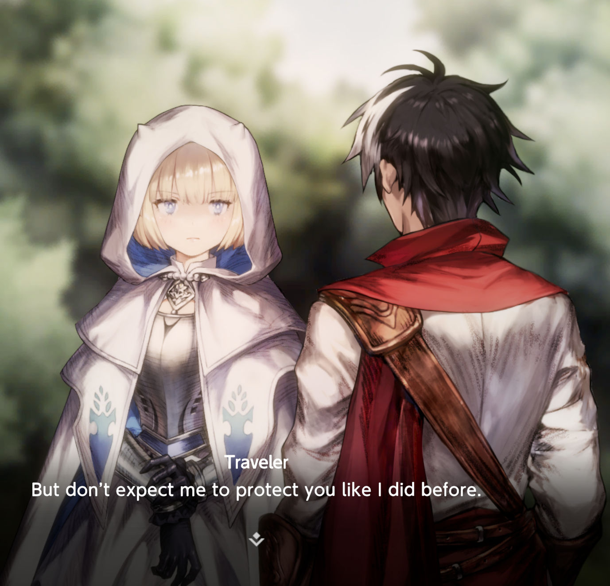  
 
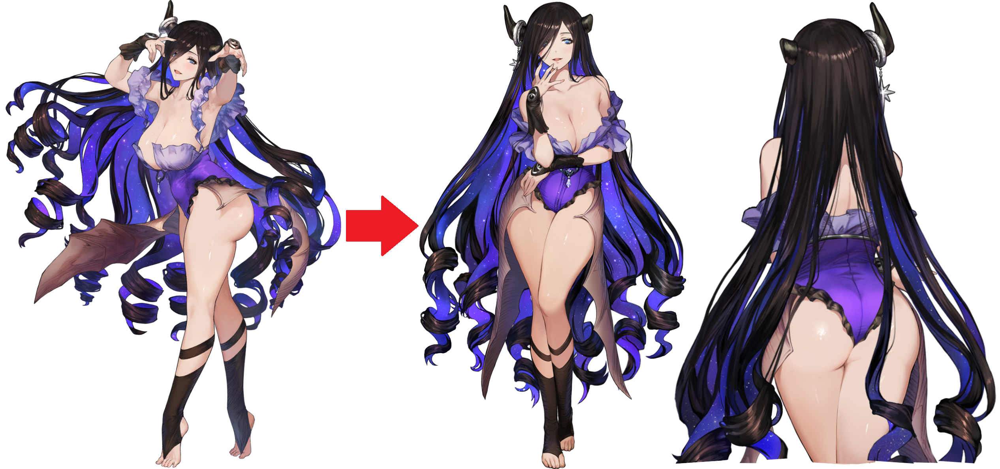  

 

The Light Novel Talk Models are mostly used in the Story Pack 1 to 10 after that its rare that characters get such a model.  
In the example with Eclipse the pose of those models are less dynamic and most of them get a back view.  

[Go to Light Novel Talk Models](assets/spine/light_novel_talk/)

### Miscellaneous Models

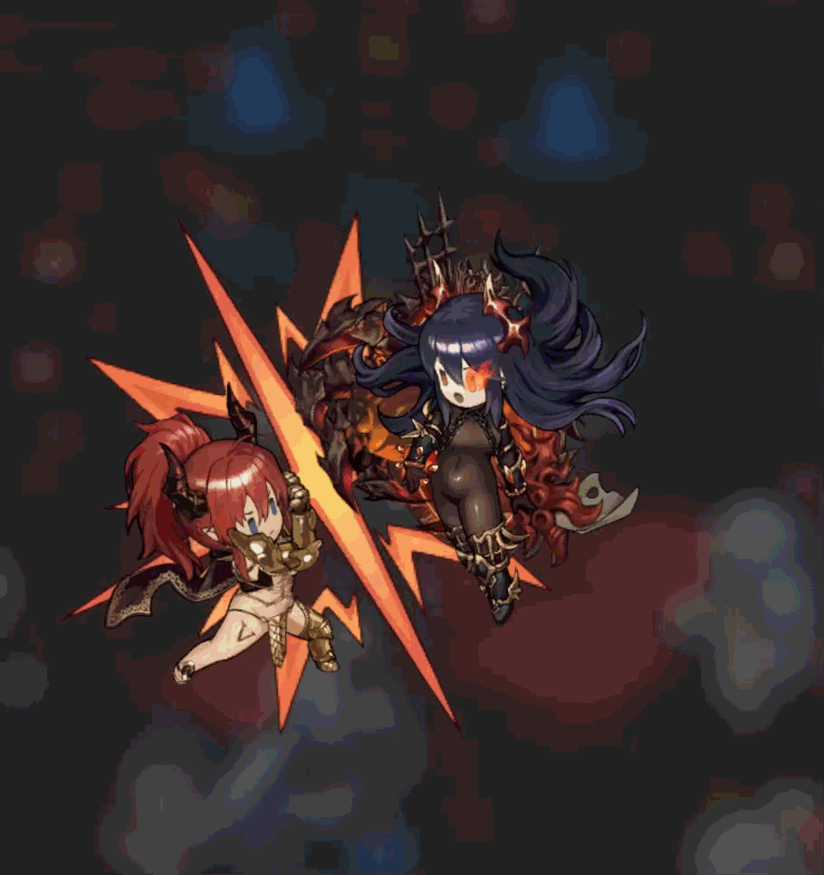  

 

Spines models for skip animations in PvP and other random porposes.  

[Go to Miscellaneous Models](assets/spine/miscellaneous/)

### NPC Models

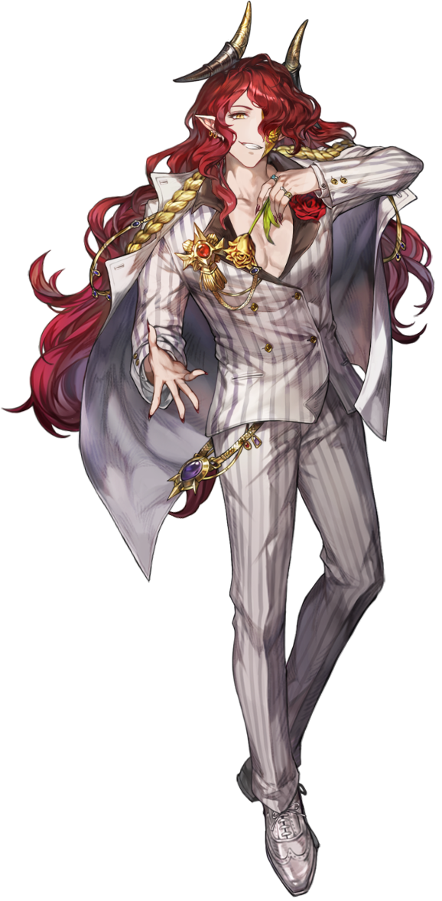  

 

The NPC's from all shops, modes or events that have a spine model are sorted by character name.  

[Go to NPC Models](assets/spine/npc/)

### Skill Cutscenes

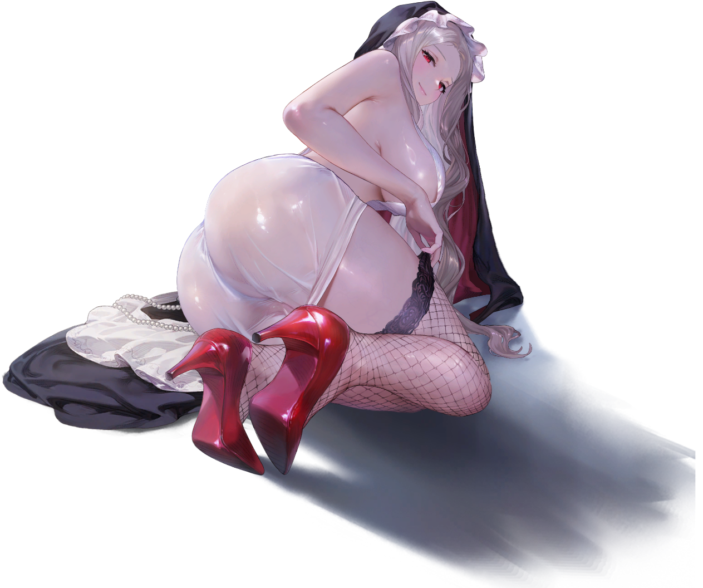  
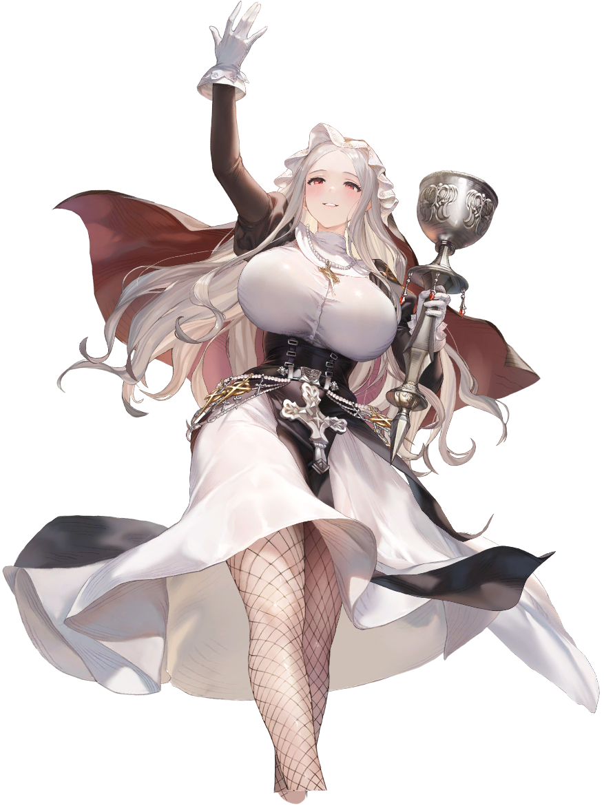  

 

The skill cutscene models are sorted by Charater name and Costume. If a Character only has one costume all the needed files are directly in the Character folder.  
Not every Character has a cutscene therefore some characters are not in there.  
The models dont have the background backed in. Those will be added later in a separate folder unsorted.  
Prestige Skin Skill Cutscene Models are included in the Character Folder.  

[Go to Skill Cutscene Models](assets/spine/skill_cutscene/)

### Special Animation Models

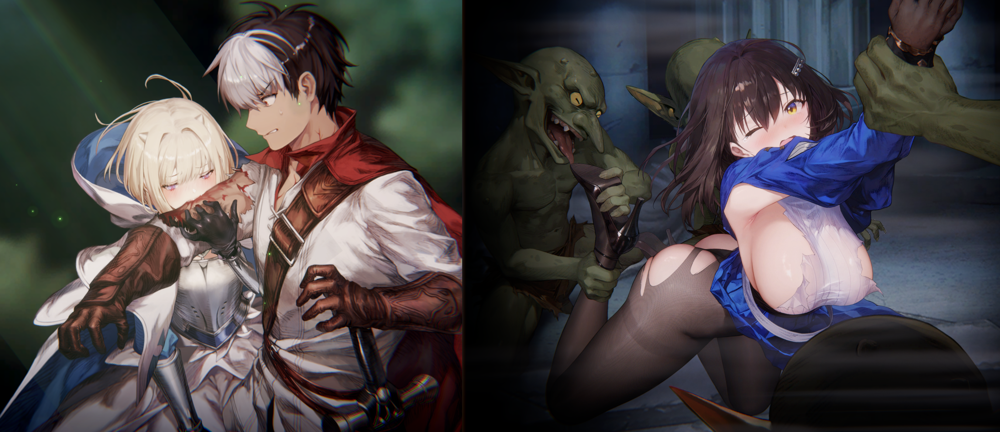  

 

Speical animation models and images used in story / character / content / event packs.  

[Go to Special Animations](assets/spine//special_animation/)

## UI
### Costume Faces

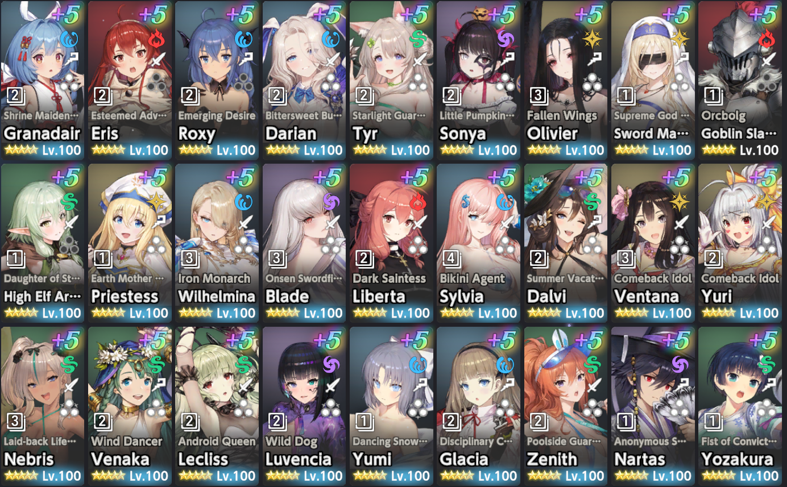  

 

All faces of the costumes used in the Companion Menu.  
Those faces are only from playable costumes, skins, temporary companions or summons.

[Go to Costume Faces](assets/ui/costume_face/)

### Costume Icons

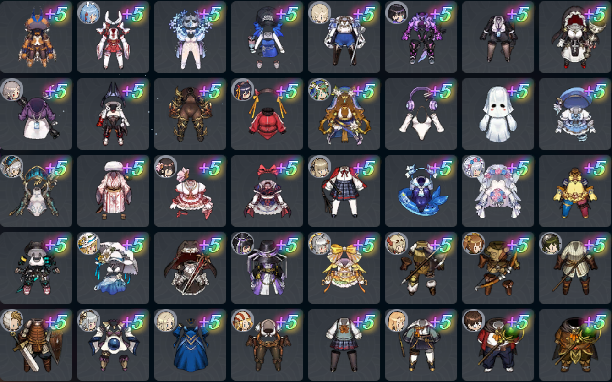  

 

All icons of the costumes used in the Bag Menu under Costume or in the Collection under Costumes.  
Those icons are only from playable costumes, skins or temporary companions.

[Go to Costume Icons](assets/ui/costume_icon/)

### Costume Skill Faces

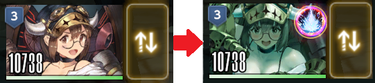  

 

All faces of the costumes used in the battle after a skill has been activated.  
Those faces are only from playable costumes, skins, temporary companions or summons.

[Go to Costume Skill Faces](assets/ui/costume_skill_face/)

### Skill Cutscene Backgrounds

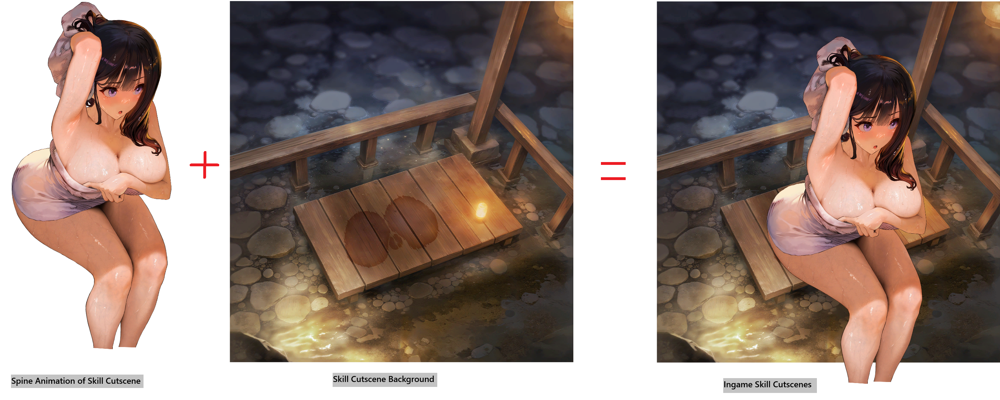  

 

All backgrounds of the costumes used in the spine animation of the skill cutscenes.  
Those background images are only from playable units with skill cutscenes.  

[Go to Costume Skill Faces](assets/ui/skill_cutscene_background/)

### Skill Icons

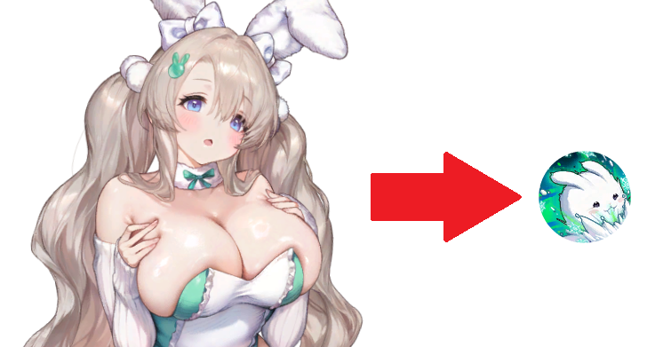  

 

All Skill Icons from costumes and bosses.  
Icon 000 to 999 are for costume icons.  
Icon >1000 bosses from different game modes.  
The icons are numbered in asending order of the costume release date.

[Go to Skill Icons](assets/ui/skill_icons/)

### Speech Bubble Faces

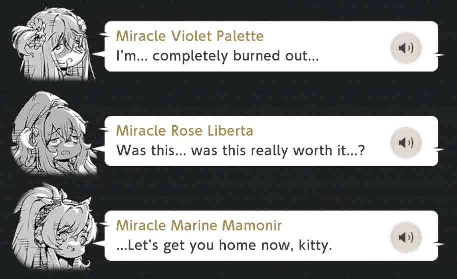  

 

All faces used in story / character / content / event packs for speech bubbles.  
Only from playble characters and some random others.  
NPC will follow later.

[Go to Speech Bubble Faces](assets/ui/speech_bubble_faces/)

### Wallpapers

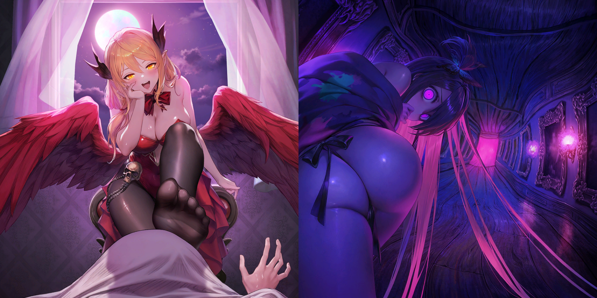  

 

All the Wallpapers from Story Packs, Character Packs, Content Packs, Event Packs, Skill Cutscenes and Special Cutscenes from Story or Events.

[Go to Wallpapers](assets/ui/wallpapers/)

## Chibis

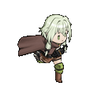  
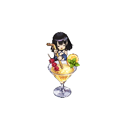  

 

All the chibi sprites used to make the animations for the playable characters.  
Sorted by character name and costume.

[Go to Chibis](assets/chibis/)

## Known Issues

On Extraction some Spine models dont have the right png sizes. With that the animations look cursed.  
I fixed them manuel atm  
Need to include a proper check so that can be automatically be corrected.  

## Report Issues

If you find any other weird file naming or files that doesnt match the default pattern of that section pls open an issue  
The same goes for stuff you like to have included in the repo  

Make a Issue [here](https://github.com/Zormolo/Brown-Dust-2-Assets/issues)

I will ofc add more stuff  
but what is there atm is the most important for most ppl  
I will also add the audio files when i have a good CLI client to extract them from the bank-files

## 3rd Party Dependencies
### Assets Extractor

The extractor is made by Aelurum. Version 1.2.3 of the CLI is used.  
Link to Repo --> https://github.com/aelurum/AssetStudio

### Catalog Decoder Script from Myssal
Link to Profil --> https://github.com/myssal
